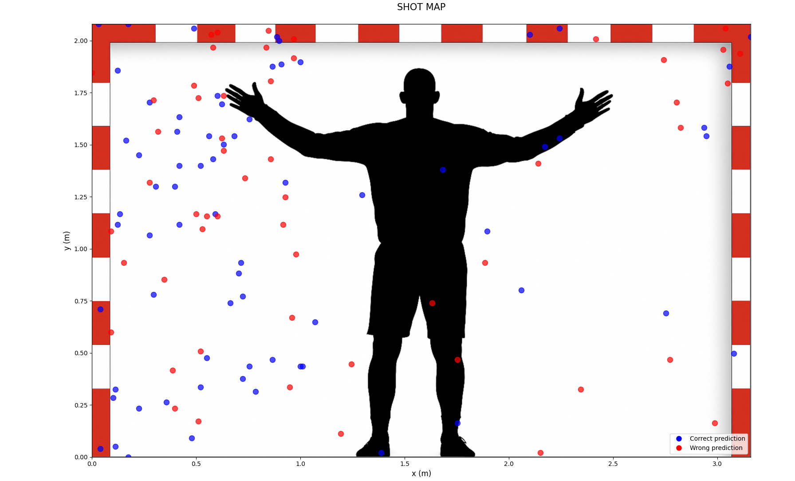

# NeuroGoalkeeper: ANN-Based Training Simulator for Handball Goalkeepers


Simulated training environment for handball goalkeepers powered by a custom-built artificial neural network and an interactive Tkinter GUI. Originally developed as a bachelor thesis and later refined into a standalone application.

---

## Author

Íñigo Rodríguez Sánchez  
Data & Artificial Intelligence Engineer

---

## Table of Contents

- [Introduction](#introduction)
- [Key Features](#key-features)
- [Interface Overview](#interface-overview)
- [Refactor Overview](#refactor-overview)
- [Project Structure](#project-structure)
- [Script Overview](#script-overview)
- [Utilities](#utilities)
- [Installation](#installation)
- [Usage](#usage)
- [Important Notes](#important-notes)
- [Final Words](#final-words)

---

## Introduction

NeuroGoalkeeper is a modular training simulator for handball goalkeepers based on a custom-built artificial neural network (ANN). The system simulates goalkeeper responses to various shot patterns and learns from those interactions over multiple epochs.

Developed originally as an academic project, the application integrates data preprocessing, ANN logic, and visual interaction via a Tkinter-based interface. The training process is entirely self-contained: shot patterns are either loaded from a dataset or generated interactively, then normalized and used to train the ANN.

The project serves both as a pedagogical tool for neural network understanding and as a practical simulation platform for sports-oriented machine learning experimentation.

> This project was initially developed as a Bachelor Thesis at Universidad Politécnica de Madrid (UPM).  
> 📄 Official repository: [https://oa.upm.es/62850/](https://oa.upm.es/62850/)


---

## Key Features

- Artificial neural network implemented from scratch and adapted for this simulator  
  > Core ANN logic originally based on a tutorial by Jason Brownlee, further extended and integrated into the full system.  
  > 📄 Source: [https://machinelearningmastery.com/implement-backpropagation-algorithm-scratch-python/](https://machinelearningmastery.com/implement-backpropagation-algorithm-scratch-python/)
- Simulated training environment for handball goalkeepers
- Three training modes: General, External (CSV-based), and Custom (interactive goal shooting)
- Clean and modular code structure with dedicated folders for GUI, ANN logic, and assets
- Full English translation of codebase and UI texts
- In-app training log viewer with scrollable and readable formatting
- Markdown training reports generated alongside raw `.txt` logs
- Timestamped training reports to preserve session history and avoid overwrites
- Dynamic GUI with improved layout and fullscreen support

---


## Interface Overview

Below are sample views of the application's interface and output visualizations:

| Initial Overview                                          |
|-----------------------------------------------------------|
|  |

| Training Type Selection                                           |
|-------------------------------------------------------------------|
|  |

| Example Shot Map Output                               |
|-------------------------------------------------------|
|  |
---

## Refactor Overview

This project is an extended and cleaned-up version of the original Bachelor's Thesis implementation. Key improvements include:

| Area                | Original (TFG)                                 | Current Version                                     |
|---------------------|-----------------------------------------------|-----------------------------------------------------|
| Interface Language  | Mixed (Spanish + English)                     | Fully in English                                    |
| Code Structure      | Monolithic, low modularity                    | Modular design with separate folders per component  |
| ANN Logic           | Embedded in single script                     | Isolated in its own module with improved logging    |
| Output Format       | Plain `.txt` log only                         | `.txt` + auto-generated `.md` report                |
| Custom Training     | Present but visually inconsistent             | Fully refactored with dynamic button layout         |
| Dataset Handling    | Fixed logic, hardcoded paths                  | Robust path handling via `utils/paths.py`           |
| UI Design           | Fixed window sizes, limited responsiveness    | Fullscreen support, consistent layout across screens|

These changes improve usability, maintainability, and adaptability for future enhancements.

---

## Project Structure

```bash
NeuroGoalkeeper/
├── ann/ # ANN logic and training process
├── gui/ # Tkinter-based GUI windows
├── utils/ # Utility functions (paths, file helpers)
├── datasets/ # CSV datasets for training
├── images/ # Static visual assets (goal, icons)
├── outputs/ # Training output logs and reports
├── app.py # Main application launcher
├── requirements.txt # Python dependencies
├── .gitignore # Ignored files and folders
└── README.md # Project documentation
```

---

## Script Overview

| File                              | Description                                                                 |
|-----------------------------------|-----------------------------------------------------------------------------|
| `app.py`                          | Main launcher of the application; handles window transitions and fullscreen behavior |
| `ann/neural_network.py`           | Full implementation of the artificial neural network and training logic     |
| `gui/custom_training_window.py`   | Interactive shot generation interface using goal layout                     |
| `gui/dataset_view_window.py`      | Displays selected dataset before training                                   |
| `gui/error_term_window.py`        | Graph of error term evolution during training                               |
| `gui/parameter_selection_window.py` | Collects ANN hyperparameters from the user                               |
| `gui/predictions_window.py`       | Lists ANN predictions with input and output values                          |
| `gui/results_window.py`           | Shows training log, predictions, and access to graphs                       |
| `gui/start_window.py`             | Initial project description screen and ANN summary                          |
| `gui/stats_window.py`             | Final performance metrics                                                   |
| `gui/training_type_window.py`     | Mode selection window (general, external, custom)                           |

---

## Utilities

- `utils/paths.py` – Provides project-root-relative file resolution to reliably load datasets and images from any script or module.

---

## Installation

1. Clone this repository:
```bash
git clone https://github.com/YOUR_USERNAME/NeuroGoalkeeper.git
cd NeuroGoalkeeper
```

2. (Optional but recommended) Create and activate a virtual environment:
```bash
python -m venv .venv
source .venv/bin/activate  # On Windows: .venv\Scripts\activate
```

3. Install required Python packages:
```bash
pip install -r requirements.txt
```

---

## Usage

Once installed, you can launch the application with:

```bash
python app.py
```

This will open a graphical interface where you can select a training mode, configure the ANN parameters, and view training results and visualizations.

All outputs will be saved under the /outputs/ directory, including:

- training_summary.txt: full training log
- training_report.md: Markdown version of the training summary
- Plots and prediction visualizations

---

## Important Notes

- The application is designed for educational and experimental purposes; its ANN is not optimized for production-grade performance.
- All datasets must follow the expected CSV format with five columns: Distance, Speed, X, Y, and Expected Output.
- The ANN expects numeric inputs only. Incorrect formatting may lead to parsing errors.
- The `Custom Training` mode requires at least two simulated shots before continuing.
- If run outside the project root, some paths (e.g. to `/images` or `/datasets`) may fail unless properly adjusted.

---

## Final Words

This project was originally developed as part of a *Bachelor Thesis in Telecommunications Engineering* at Universidad Politécnica de Madrid, and later evolved into a standalone ANN-based simulator.

Whether you're a student exploring neural networks, a developer interested in sports simulations, or simply curious about machine learning from scratch, I hope this project offers value and insight.

Feel free to explore the code, test the different training modes, or adapt the project to new use cases.

**If you’ve found this project useful or inspiring — feel free to build on it, break it, or just drop a star ⭐.**
